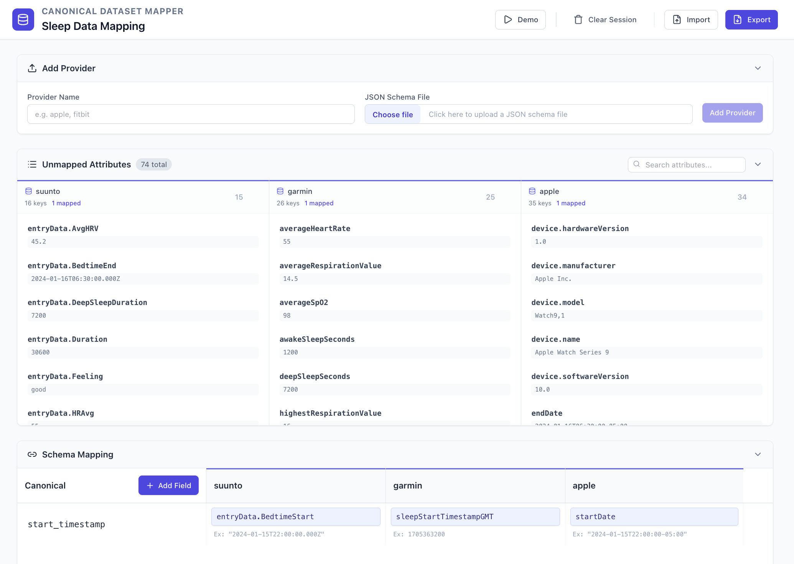

# Canonical Dataset Mapper

A web-based tool for mapping data attributes from multiple providers to a unified canonical schema. Perfect for ETL workflows, data integration, and schema standardization.



## What It Does

The Canonical Dataset Mapper helps you:
- **Upload JSON schemas** from multiple data providers (e.g., Apple, Garmin, Suunto)
- **Map attributes** from each provider to canonical field names
- **Track unmapped attributes** to ensure complete data coverage
- **Export mappings** as JSON for use in your data pipelines
- **Import previous mappings** to continue your work

## Quick Start

### Prerequisites

- Node.js 18+ and npm

### Installation

1. **Install dependencies:**
   ```bash
   npm install
   ```

2. **Start the development server:**
   ```bash
   npm run dev
   ```

3. **Open your browser:**
   Navigate to `http://localhost:3000`

### Try the Demo

Click the **Demo** button in the header to load sample sleep data from three providers (Apple, Garmin, Suunto) and explore the mapping interface.

## Usage

1. **Add Providers**: Upload JSON schema files from your data providers
2. **Create Canonical Fields**: Click "Add Field" to define your canonical schema
3. **Map Attributes**: Select provider attributes for each canonical field
4. **Review Unmapped**: Check the Unmapped Attributes section to ensure complete coverage
5. **Export**: Save your mappings as JSON for use in your ETL pipelines

## Build for Production

```bash
npm run build
```

The built files will be in the `dist/` directory.

## License

See [LICENSE](LICENSE) file for details.
